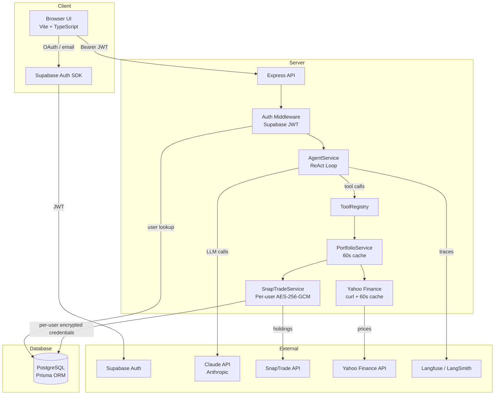

# Architecture

> Portfolio Analyzer — A standalone AI-powered portfolio analysis agent using Claude, SnapTrade, and Yahoo Finance.

## System Overview



## Request Flow

```
POST /api/chat { message, conversationHistory }
  |
  v
[Auth Middleware] -- verify Supabase JWT, resolve/create User in Prisma
  |
  v
[AgentService.chat()]
  |-- Build system prompt (baseCurrency, language, date)
  |-- Start ReAct loop (max 15 iterations, 45s timeout, 100k token limit)
  |     |
  |     |-- LLM call with system prompt + registered tools
  |     |-- Extract tool_use blocks from response
  |     |-- [Iteration 1 only] Synthetic tool injection
  |     |     (auto-call getPortfolioSnapshot/getPerformance if intent detected)
  |     |-- Circuit breaker check (same tool+args called 3+ times → stop)
  |     |-- Execute tools in parallel via ToolRegistry
  |     |-- Append results to conversation
  |     |-- Check termination: end_turn | timeout | cost_limit | max_iterations | circuit_breaker
  |     |-- Loop
  |     |
  |-- Post-process: inject disclaimers, sanitize forbidden phrases
  |-- Verify response (hallucination checks, confidence adjustment)
  |-- Compute confidence score (0-1)
  |
  v
{ answer, confidence, warnings, toolTrace, loopMeta }
```

## Registered Tools

| Tool | Purpose | Data Source |
|------|---------|-------------|
| `getPortfolioSnapshot` | Full holdings with allocations by symbol and asset class | SnapTrade + Yahoo Finance |
| `getPerformance` | Point-in-time gain/loss and total return % | SnapTrade + Yahoo Finance |
| `simulateAllocationChange` | What-if: add/sell positions, see new allocation | Current snapshot + math |
| `portfolioRead` | Generic read (holdings or performance) | PortfolioService |
| `getMarketPrices` | Live stock/crypto prices | Yahoo Finance |
| `connectBrokerage` | Initiate SnapTrade Connection Portal | SnapTrade |

Portfolio tools are conditionally registered only when SnapTrade credentials are configured. `getMarketPrices` requires `AGENT_ENABLE_MARKET=true`.

## Valuation Fallback Chain

```
Yahoo Finance live price (preferred)
  --> SnapTrade institution value (if Yahoo unavailable)
    --> Cost basis (last resort)
```

The `valuationMethod` field in responses indicates which source was used: `'market'` or `'cost_basis'`.

## Data Model (Prisma)

```
User
  id              UUID (PK)
  supabaseUserId  String (unique) -- mapped from Supabase Auth
  email           String?
  brokerageConnections  BrokerageConnection[]

BrokerageConnection
  id                    UUID (PK)
  userId                FK -> User.id
  snaptradeUserId       String -- SnapTrade user ID
  userSecretEncrypted   String -- per-user AES-256-GCM (key derived via PBKDF2 from supabaseUserId + ENCRYPTION_SALT)
  institutionName       String?
  lastSyncedAt          DateTime?
```

No portfolio data is persisted. Holdings are fetched live from SnapTrade on each request, enriched with Yahoo prices, and cached in-memory for 60 seconds per user.

## Per-User Encryption

SnapTrade credentials are encrypted with a **per-user derived key**, not a shared server key:

```
Key = PBKDF2(supabaseUserId, ENCRYPTION_SALT, 100000 iterations, 32 bytes, SHA-512)
Cipher = AES-256-GCM with random 12-byte IV per encryption
Format = base64(IV || AUTH_TAG || CIPHERTEXT)
```

This means:
- A database admin cannot decrypt any user's credentials without knowing both `ENCRYPTION_SALT` and the user's `supabaseUserId`
- Each user's data is isolated cryptographically — compromising one key doesn't affect others
- Legacy secrets (encrypted with the shared `ENCRYPTION_KEY`) are lazily re-encrypted with the per-user key on next access

## API Routes

| Route | Method | Auth | Purpose |
|-------|--------|------|---------|
| `/health` | GET | No | Health check |
| `/api/auth/status` | GET | Yes | Check auth status |
| `/api/chat` | POST | Yes | Agent chat endpoint |
| `/api/snaptrade/register` | POST | Yes | Register user with SnapTrade (idempotent) |
| `/api/snaptrade/connect-url` | GET | Yes | Get SnapTrade Connection Portal URL |
| `/api/snaptrade/connections` | GET | Yes | List connected brokerages |
| `/api/snaptrade/accounts` | GET | Yes | List brokerage accounts |
| `/api/snaptrade/holdings` | GET | Yes | Fetch current holdings (not persisted) |

## Auth Flow

- **Production**: Supabase JWT verification via `supabase.auth.getUser(token)`. User record auto-created in Prisma on first login.
- **Dev mode** (no `SUPABASE_URL`): All requests pass with `userId='dev-user'`.
- **Eval mode**: Requests with `token === EVAL_JWT` bypass Supabase.

## Observability

- **Langfuse**: Wraps each `agent-chat` call as a trace with userId, input/output, and metadata.
- **LangSmith**: Optional wrapper around Anthropic client for LLM call tracing.
- **Tool Trace**: Every response includes `toolTrace[]` with tool name, duration, success/error per call.

## Key Configuration

| Category | Env Var | Default |
|----------|---------|---------|
| LLM | `AGENT_MODEL` | `claude-sonnet-4-20250514` |
| LLM | `AGENT_MAX_TOKENS` | `4096` |
| LLM | `AGENT_TEMPERATURE` | `0.2` |
| Guardrails | `AGENT_MAX_ITERATIONS` | `15` |
| Guardrails | `AGENT_TIMEOUT_MS` | `45000` |
| Guardrails | `AGENT_COST_LIMIT_TOKENS` | `100000` |
| Guardrails | `AGENT_CIRCUIT_BREAKER_THRESHOLD` | `3` |
| Portfolio | `AGENT_ENABLE_MARKET` | `false` |
| Portfolio | `AGENT_VALUATION_FALLBACK` | `cost_basis` |
| Encryption | `ENCRYPTION_KEY` | (required, legacy shared key) |
| Encryption | `ENCRYPTION_SALT` | (required, per-user key derivation) |
